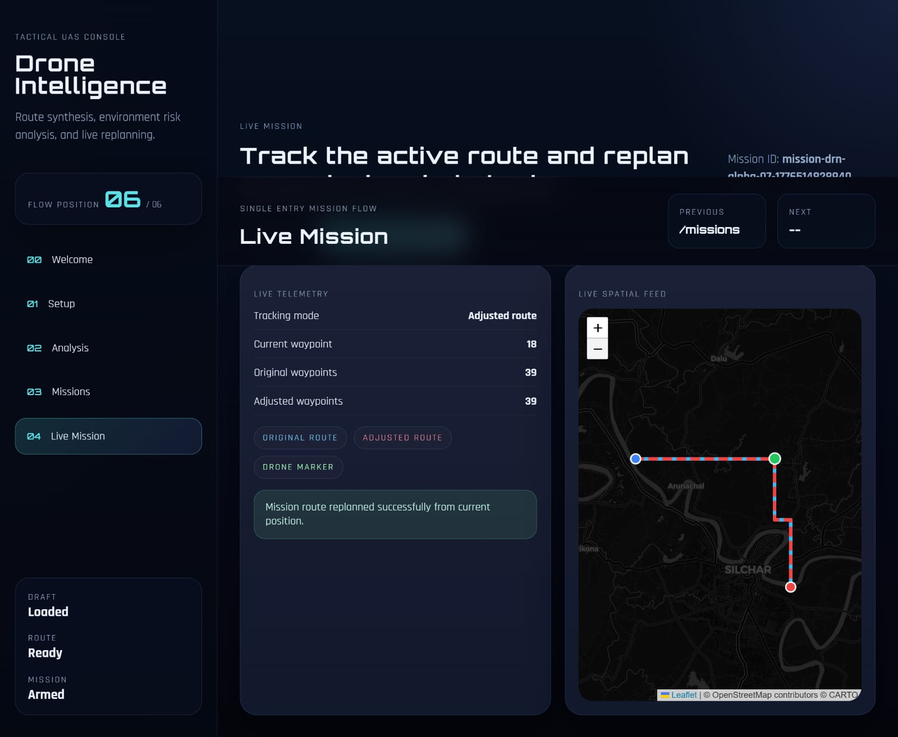

# 🚁 AI-Based Drone Navigation & Monitoring System

## 📌 Overview

This project is a **software-based drone navigation and monitoring system** designed to simulate intelligent drone behavior using real-time object detection and visualization.

It leverages a **pre-trained YOLO (You Only Look Once) model** to detect obstacles and relevant entities from visual input and integrates the results into an interactive dashboard for monitoring and analysis.

---

## 🎯 Features

* 🧠 **Object Detection using YOLO**

  * Detects obstacles and entities from image/video input

* 📊 **Interactive Dashboard**

  * Displays detections, system status, and navigation insights

* ⚙️ **Backend Processing**

  * Processes detection outputs and manages data flow

* 🔄 **Navigation Simulation**

  * Simulates drone decision-making based on detection results

* 🧩 **Modular Architecture**

  * Separate frontend and backend for better scalability

---

## 🏗️ System Architecture

Input (Image/Video) → YOLO Model → Backend Processing → Decision Logic → Frontend Dashboard

---

## 🛠️ Tech Stack

* **Language**: Python
* **Computer Vision**: YOLO
* **Backend**: FastAPI , A* / Dijkstra
* **Frontend**:React,TypeScript 
* **Libraries**: OpenCV, NumPy

---

## 👩‍💻 My Contribution
- Contributed to integration of YOLO-based object detection for real-time analysis  
- Assisted in backend development for processing detection outputs  
- Participated in testing, debugging, and improving system performance


---

## 📷 Sample Output

### Frontend View


### Backend View


### Outcome: Live Missiom

---

## 🚀 How to Run

### 1. Clone the repository

```bash
git clone https://github.com/Priya021-hub/ARecon
cd ARecon
```

---

### 2. Backend Setup

```bash
cd backend
pip install -r requirements.txt
uvicorn app.main:app --reload
```

👉 Open Swagger UI:
http://127.0.0.1:8000/docs

---

### 3. Frontend Setup

```bash
cd frontend
npm install
npm run dev
```

👉 Open in browser:
http://localhost:5173

---

### 4. Environment Variables

Create a `.env` file inside the `backend/` folder and add:

```
WEATHER_API_KEY=your_openweather_api_key
```

---

## 📈 Future Improvements

* Integration with real drone hardware
* Advanced path planning algorithms
* Real-time video stream processing
* Improved UI/UX design

---

## 🤝 Team Project

This project was developed as part of a collaborative team effort.

---

## 📬 Contact

GitHub: https://github.com/Priya021-hub
